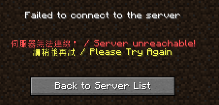
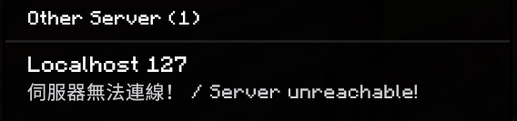
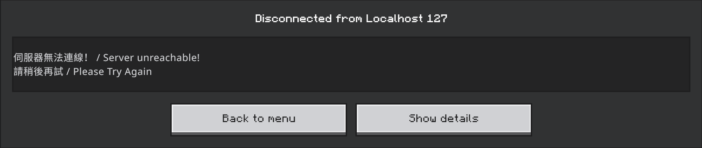

# redir-rust

A Rust port redirector with plugin support, inspired by `redir`. Relays TCP or
UDP traffic from a local listen address to one or more backend targets, with
optional plugin hooks that keep clients from just timing out when the backend
is down (e.g. a Minecraft "server offline" MOTD).

## Usage

Run a single redirect from CLI flags:

```sh
cargo run -- --listen 0.0.0.0:25565 --target 127.0.0.1:25566
```

Repeat `--target` to provide failover targets in priority order:

```sh
cargo run -- --listen 0.0.0.0:25565 \
  --target 10.0.0.10:25566 \
  --target 10.0.0.11:25566
```

Or run one or more redirects defined in a TOML file (see `config.example.toml`):

```sh
cargo run -- --config config.toml
```

When `--config` is present it takes precedence; redirect flags such as
`--listen` and `--target` are accepted but ignored.

Pass `--debug` for verbose logging (shorthand for `RUST_LOG=debug`; an
explicit `RUST_LOG` env var still takes precedence). See all available flags:

```sh
cargo run -- --help
```

## Targets and failover

Each `[[redirect]]` must set exactly one of `target` or `targets`. The legacy
singular form remains supported:

```toml
target = "127.0.0.1:25566"
```

For failover, use a non-empty array ordered from highest to lowest priority:

```toml
targets = [
  "10.0.0.10:25566", # primary
  "10.0.0.11:25566", # secondary
]
```

The two forms are mutually exclusive, and `targets = []` is invalid. On the
CLI, repeated `--target` flags build the same ordered list.

For TCP, every new connection tries the targets sequentially until one
connects. `connect_timeout_ms` (or `--connect-timeout`) applies separately to
each target attempt. Once connected, that client stays pinned to the selected
backend for the life of the connection. New connections always begin with the
primary again, so they automatically fail back after it recovers. Failure
plugins run only after every target attempt fails.

Multi-target UDP failover is specifically for Bedrock servers: on the first
datagram of each new client session, the relay asynchronously probes the
ordered targets with RakNet `Unconnected Ping` packets. Initial client
datagrams are queued during selection, then flushed to the first responding
backend; that session remains pinned there until its UDP idle timeout expires.
New sessions start at the primary again. If all probes fail, the Bedrock
offline plugin handles the queued packets when enabled. Single-target generic
UDP does not receive Bedrock preflight probes; it remains a direct relay.

## Plugins

The built-in offline response paths below take over only after all configured
backend targets are unreachable. The TCP `Plugin` trait also has earlier
lifecycle hooks such as `on_connect` and `on_data_receive`, while the Bedrock
offline path uses background reachability probing for a single target. Each
built-in offline response is protocol-specific (TCP vs UDP) and configured
under its own `[redirect.*.plugins]` table; setting the wrong one for a
redirect's protocol is a no-op with a startup warning, not an error.

### `minecraft` — Java Edition offline MOTD (TCP)

Source: [`src/plugins/minecraft_offline.rs`](src/plugins/minecraft_offline.rs).

When none of a TCP redirect's targets can be reached, this speaks just enough
of the Java Edition protocol to reply appropriately based on what the client
is doing:

- **Server list ping**: returns a canned Server List Ping status JSON (custom
  status line, two MOTD lines, optional base64 favicon) instead of the
  connection just failing.
- **Join attempt**: sends a Login Disconnect with the same MOTD text as a
  VarInt-length-prefixed JSON chat component.

Config (`[redirect.minecraft.plugins]`, all fields but `enabled` optional):

```toml
[redirect.minecraft.plugins]
enabled = true
status_line = "§c伺服器無法連線！ / Server unreachable!"
motd_line1 = "§c找不到對應的伺服器 / Server not found"
motd_line2 = "§e請檢查您的連線域名 / Please check your connection domain"
# favicon_path = "assets/offline_icon.png"   # 64x64 PNG; defaults to a built-in scroll icon
```

Equivalent CLI flags (single-redirect mode only):
`--minecraft-offline-motd`, `--status-line`, `--motd-line1`, `--motd-line2`,
`--favicon-path`.




**Protocol support**: version-agnostic. Java Edition's Login Disconnect packet
uses a length-prefixed JSON reason across supported protocol versions. NBT
components used by disconnect packets in later protocol states do not apply
to this login-state response.

### `bedrock` — Bedrock Edition offline MOTD (UDP)

Source: [`src/plugins/bedrock_offline.rs`](src/plugins/bedrock_offline.rs).

Bedrock has no persistent handshake to hook into failure like TCP does. For a
single-target UDP redirect with this plugin enabled, a background prober checks
the target every few seconds. For a multi-target UDP redirect, target selection
instead happens per new client session using ordered RakNet `Unconnected Ping`
probes as described above. While no backend is reachable:

- **Server list ping**: an `Unconnected Pong` is synthesized directly, no
  RakNet connection involved.
- **Join attempt**: a `FakeSession` completes just enough of the real RakNet
  handshake and the pre-login Minecraft handshake
  (`RequestNetworkSettings`/`NetworkSettings`, waiting out the fragmented
  `Login` packet) to reach a point where the client accepts a `Disconnect`
  packet carrying the same MOTD text, then the fake session is torn down.

`§`-color codes work in the MOTD ping (rendered by the normal server-list/chat
font) but **not** on the disconnect/kick screen itself — that's a different,
more limited UI layer in the client that doesn't interpret Minecraft
formatting codes, so `§c`/`§e` show up literally there. Not a bug on this
end, just a client UI limitation.

Config (`[redirect.bedrock.plugins]`, both MOTD fields optional):

```toml
[redirect.bedrock.plugins]
enabled = true
# No leading `§` codes here: they work fine in the server-list MOTD ping,
# but the disconnect/kick screen doesn't render them (see note above).
motd_line1 = "伺服器無法連線！ / Server unreachable!"
motd_line2 = "請稍後再試 / Please Try Again"
```

Equivalent CLI flags (single-redirect mode only):
`--bedrock-offline-motd`, `--bedrock-motd-line1`, `--bedrock-motd-line2`.




**Protocol support**: unlike the Java plugin, this one has a few hardcoded
assumptions rather than reading the client's declared version:

- The MOTD ping's `Unconnected Pong` string hardcodes `protocol=766;
  version=1.21.60` regardless of the connecting client's real version. This
  is purely cosmetic — very different client versions may show a
  version-mismatch indicator in the server list, but the MOTD text itself
  still displays.
- The join-attempt path (RakNet handshake → `NetworkSettings` →
  `Disconnect`) was reverse-engineered against a live client and cross-
  checked against [pmmp/BedrockProtocol](https://github.com/pmmp/BedrockProtocol)
  (actively maintained, currently accurate as of writing). It negotiates
  compression algorithm `none`, which every client version observed so far
  accepts, and doesn't otherwise branch on protocol version. If a future
  protocol revision changes `Disconnect`'s wire layout again, the symptom
  will be the same as before this was fixed: the client shows its own
  generic decode-error screen instead of the custom MOTD text. `--debug`
  logging (see `bedrock offline: *` lines in
  `src/plugins/bedrock_offline.rs`) traces every handshake stage to help
  pin down where a future mismatch happens.

## Traffic shaping (TCP only)

Source: [`src/shaping.rs`](src/shaping.rs). Ported from the original
`redir`'s `-m`/`-o`/`-w`/`-z` flags. Unlike the plugins above, this isn't
tied to backend failure — it always applies to a TCP redirect's traffic
when configured, in both the per-connection worker path (Unix, real
deployments) and the in-process fallback path (non-Unix, e.g. local
Windows testing). It's a no-op (falls straight through to a plain, fast
`io::copy`) unless at least one of `max_bandwidth_bps`/`random_wait_ms` is
set — configuring only `wait_in_out`/`bufsize_bytes` with neither of those
does nothing.

```toml
[[redirect]]
name = "shaped-tcp"
listen = "0.0.0.0:8082"
target = "127.0.0.1:8083"
max_bandwidth_bps = 1000000   # bits/second cap; omit for unlimited
wait_in_out = "both"          # "in" (client->target), "out" (target->client), or "both" (default)
random_wait_ms = 20           # up to this many ms of random delay per chunk; omit for no jitter
bufsize_bytes = 16384         # read/write chunk size shaping is applied at (default 16384)
```

Equivalent CLI flags (single-redirect mode only):
`--max-bandwidth`, `--wait-in-out`, `--random-wait`, `--bufsize`.

## Install (Linux)

No Rust toolchain or checkout needed — the installer downloads a published
release binary, verifies its sha256, installs it to `/usr/local/bin`, and
sets up the systemd service:

```sh
curl -fsSL https://raw.githubusercontent.com/windowsedd/redir-rust/main/install.sh | sudo bash
```

It defaults to the latest release and the static musl build (works on any
glibc version). Options: `--version v0.1.0`, `--target x86_64-unknown-linux-gnu`,
`--bin-dir /opt/bin`, `--no-service` to skip the systemd setup, `--help`.
Re-run it to upgrade in place; an existing `/etc/redir-rust/config.toml` is
left alone.

Building from a checkout instead is
[`packaging/systemd/install.sh`](packaging/systemd/install.sh).

### Updating

[`update.sh`](update.sh) checks the installed version against the latest
release and, only if it's behind, installs the new binary and restarts the
service:

```sh
curl -fsSL https://raw.githubusercontent.com/windowsedd/redir-rust/main/update.sh | sudo bash
```

The restart is a hard cut — every open connection drops — so an unattended
schedule wants an off-peak window (or `--no-restart`, and bounce the service
yourself when it suits).

It's a no-op when already current, so it's safe to run from cron. `--check`
reports what an update would do without touching anything (exit code `10`
when one is available, `0` when current); `--force` reinstalls the same
version, `--no-restart` swaps the binary without bouncing the service, and
`--unit`/`--bin-dir` cover non-default installs.

To redeploy a locally *built* binary over an existing install instead, the
binary does that itself: `sudo ./target/release/redir-rust --update`.

## Building

```sh
cargo build --release
```

Build on the machine (or matching OS) you intend to run the binary on —
cross-compiling a Linux binary from Windows requires a Linux cross-linker
(e.g. via [`cross`](https://github.com/cross-rs/cross)) that isn't set up
here by default.

### Cross-compiling from Windows with `cargo zigbuild`

[`cargo-zigbuild`](https://github.com/rust-cross/cargo-zigbuild) uses
[Zig](https://ziglang.org/) as the cross-linker, so it works from Windows
without a separate Linux toolchain:

```sh
scoop install zig
cargo install cargo-zigbuild
rustup target add x86_64-unknown-linux-musl
cargo zigbuild --release --target x86_64-unknown-linux-musl
```

The resulting static-musl binary lands at
`target/x86_64-unknown-linux-musl/release/redir-rust` and can be copied
straight to the Linux host.

### Version and build metadata

`build.rs` embeds the git commit, target triple, Cargo profile and `rustc`
version at build time, so a deployed binary can say exactly what it is:

```sh
redir-rust -V         # redir-rust 0.1.0 (2baa630dbec5 release)
redir-rust --version  # same, plus commit / target / profile / rustc lines
```

The commit is suffixed `-dirty` when the working tree had uncommitted
tracked changes, and reads `unknown` when built outside a git checkout.

### Releases

Pushing a `v*` tag runs [`.github/workflows/release.yml`](.github/workflows/release.yml),
which tests and builds `x86_64` Linux (gnu and static musl) and Windows
binaries, then publishes them as a GitHub release with `.sha256` sums:

```sh
git tag v0.1.0
git push origin v0.1.0
```

A failed publish can be re-run from the Actions tab ("Release" →
*Run workflow*) against an existing tag, without re-tagging.

## Cutting a release

```sh
./scripts/release.sh 0.2.0          # bump, refresh the lock, test, commit, tag
./scripts/release.sh 0.2.0 --push   # ...and push the branch + tag
```

The tag, `Cargo.toml` and `Cargo.lock` all have to carry the same version,
which is why this is one script rather than three manual steps. A tag that
disagrees with `Cargo.toml` would ship a binary whose `--version` lies, and
[`update.sh`](update.sh) would then see a permanent "update available" and
reinstall + restart the service on every run. The release workflow's
`verify-version` job refuses such a tag before any build starts, and
`update.sh` refuses to loop if one ever slips through.

## Running as a systemd service

See [packaging/systemd/README.md](packaging/systemd/README.md) for the unit
file, install steps, and a `service-status.sh` helper that emits
`systemctl status` as JSON.

## License

MIT — see [LICENSE](LICENSE).
