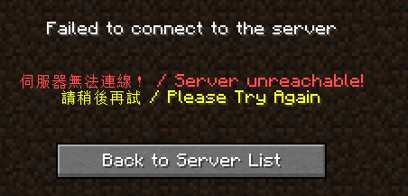
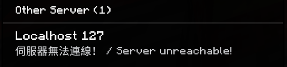
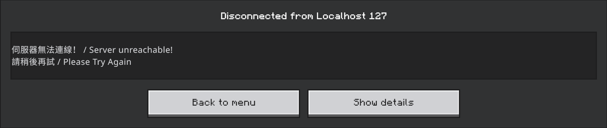

# Plugins and traffic shaping

[Back to README](../README.md)

## Plugins

The built-in offline response paths below take over only after all configured
backend targets are unreachable. The TCP `Plugin` trait also has earlier
lifecycle hooks such as `on_connect` and `on_data_receive`, while the Bedrock
offline path uses background reachability probing for a single target. Each
built-in offline response is protocol-specific (TCP vs UDP) and configured
under its own `[redirect.*.plugins]` table; setting the wrong one for a
redirect's protocol is a no-op with a startup warning, not an error.

### `minecraft` — Java Edition offline MOTD (TCP)

Source: [`src/plugins/minecraft_offline.rs`](../src/plugins/minecraft_offline.rs).

When none of a TCP redirect's targets can be reached, this speaks just enough
of the Java Edition protocol to reply appropriately based on what the client
is doing:

- **Server list ping**: returns a canned Server List Ping status JSON (custom
  status line, two MOTD lines, optional base64 favicon) instead of the
  connection just failing.
- **Join attempt**: sends a Login Disconnect with the same MOTD text as a
  VarInt-length-prefixed JSON chat component.

Config (`[redirect.minecraft.plugins]`, all fields but `enabled` optional):

```toml
[redirect.minecraft.plugins]
enabled = true
status_line = "§c伺服器無法連線！ / Server unreachable!"
motd_line1 = "§c找不到對應的伺服器 / Server not found"
motd_line2 = "§e請檢查您的連線域名 / Please check your connection domain"
# favicon_path = "assets/offline_icon.png"   # 64x64 PNG; defaults to a built-in scroll icon
```

Equivalent CLI flags (single-redirect mode only):
`--minecraft-offline-motd`, `--status-line`, `--motd-line1`, `--motd-line2`,
`--favicon-path`.




**Protocol support**: Java Edition **1.8 through 26.3** (the latest stable
release checked on 2026-09-30), including patch releases. Socket tests cover
all 50 distinct release protocol numbers in that range: status/MOTD replies,
ping/pong, direct joins, and transferred joins (introduced in 1.20.5).
This is packet-level coverage, not a test run of every game client.

The plugin uses the shared status and login wire formats without restricting
the client's version number. Login Disconnect uses a length-prefixed JSON
reason; NBT components in later protocol states do not apply here. Future
releases retaining these formats should work, but are not guaranteed. Clients
older than 1.7 use an unimplemented legacy protocol. Normal forwarding does
not translate versions; the backend must accept the connecting client.

### `bedrock` — Bedrock Edition offline MOTD (UDP)

Source: [`src/plugins/bedrock_offline.rs`](../src/plugins/bedrock_offline.rs).

Bedrock has no persistent handshake to hook into failure like TCP does. For a
single-target UDP redirect with this plugin enabled, a background prober checks
the target every few seconds. For a multi-target UDP redirect, target selection
instead happens per new client session using ordered RakNet `Unconnected Ping`
probes as described above. While no backend is reachable:

- **Server list ping**: an `Unconnected Pong` is synthesized directly, no
  RakNet connection involved.
- **Join attempt**: a `FakeSession` completes just enough of the real RakNet
  handshake and the pre-login Minecraft handshake
  (`RequestNetworkSettings`/`NetworkSettings`, waiting out the fragmented
  `Login` packet) to reach a point where the client accepts a `Disconnect`
  packet carrying the same MOTD text, then the fake session is torn down.

`§`-color codes work in the MOTD ping (rendered by the normal server-list/chat
font) but **not** on the disconnect/kick screen itself — that's a different,
more limited UI layer in the client that doesn't interpret Minecraft
formatting codes, so `§c`/`§e` show up literally there. Not a bug on this
end, just a client UI limitation.

Config (`[redirect.bedrock.plugins]`, both MOTD fields optional):

```toml
[redirect.bedrock.plugins]
enabled = true
# No leading `§` codes here: they work fine in the server-list MOTD ping,
# but the disconnect/kick screen doesn't render them (see note above).
motd_line1 = "伺服器無法連線！ / Server unreachable!"
motd_line2 = "請稍後再試 / Please Try Again"
```

Equivalent CLI flags (single-redirect mode only):
`--bedrock-offline-motd`, `--bedrock-motd-line1`, `--bedrock-motd-line2`.




**Protocol support**: unlike the Java plugin, this one has a few hardcoded
assumptions rather than reading the client's declared version:

- The MOTD ping's `Unconnected Pong` string hardcodes `protocol=766;
  version=1.21.60` regardless of the connecting client's real version. This
  is purely cosmetic — very different client versions may show a
  version-mismatch indicator in the server list, but the MOTD text itself
  still displays.
- The join-attempt path (RakNet handshake → `NetworkSettings` →
  `Disconnect`) was reverse-engineered against a live client and cross-
  checked against [pmmp/BedrockProtocol](https://github.com/pmmp/BedrockProtocol)
  (actively maintained, currently accurate as of writing). It negotiates
  compression algorithm `none`, which every client version observed so far
  accepts, and doesn't otherwise branch on protocol version. If a future
  protocol revision changes `Disconnect`'s wire layout again, the symptom
  will be the same as before this was fixed: the client shows its own
  generic decode-error screen instead of the custom MOTD text. `--debug`
  logging (see `bedrock offline: *` lines in
  `src/plugins/bedrock_offline.rs`) traces every handshake stage to help
  pin down where a future mismatch happens.

## Traffic shaping (TCP only)

Source: [`src/shaping.rs`](../src/shaping.rs). Ported from the original
`redir`'s `-m`/`-o`/`-w`/`-z` flags. Unlike the plugins above, this isn't
tied to backend failure — it always applies to a TCP redirect's traffic
when configured, in both the per-connection worker path (Unix, real
deployments) and the in-process fallback path (non-Unix, e.g. local
Windows testing). It's a no-op (falls straight through to a plain, fast
`io::copy`) unless at least one of `max_bandwidth_bps`/`random_wait_ms` is
set — configuring only `wait_in_out`/`bufsize_bytes` with neither of those
does nothing.

```toml
[[redirect]]
name = "shaped-tcp"
listen = "0.0.0.0:8082"
target = "127.0.0.1:8083"
max_bandwidth_bps = 1000000   # bits/second cap; omit for unlimited
wait_in_out = "both"          # "in" (client->target), "out" (target->client), or "both" (default)
random_wait_ms = 20           # up to this many ms of random delay per chunk; omit for no jitter
bufsize_bytes = 16384         # read/write chunk size shaping is applied at (default 16384)
```

Equivalent CLI flags (single-redirect mode only):
`--max-bandwidth`, `--wait-in-out`, `--random-wait`, `--bufsize`.
